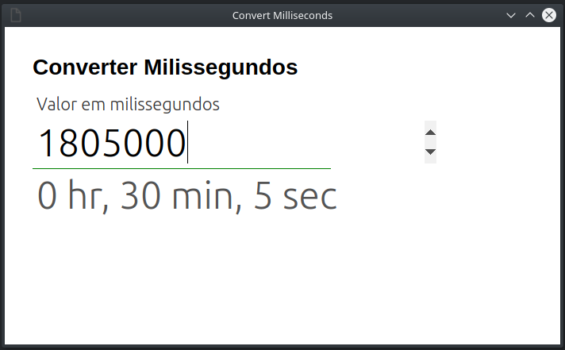

# Convert-Milliseconds

Converter milissegundos para Hora/Minuto/Segundos

# Abrir app #

    LINUX: google-chrome --app=index.html --disable-gpu
    MAC: /Applications/Google\ Chrome.app/Contents/MacOS/Google\ Chrome --kiosk index.html --disable-gpu

    firefox etc
    safari etc